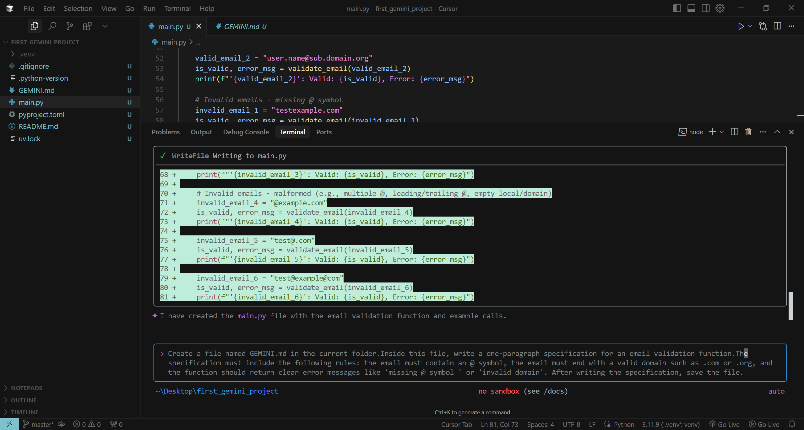
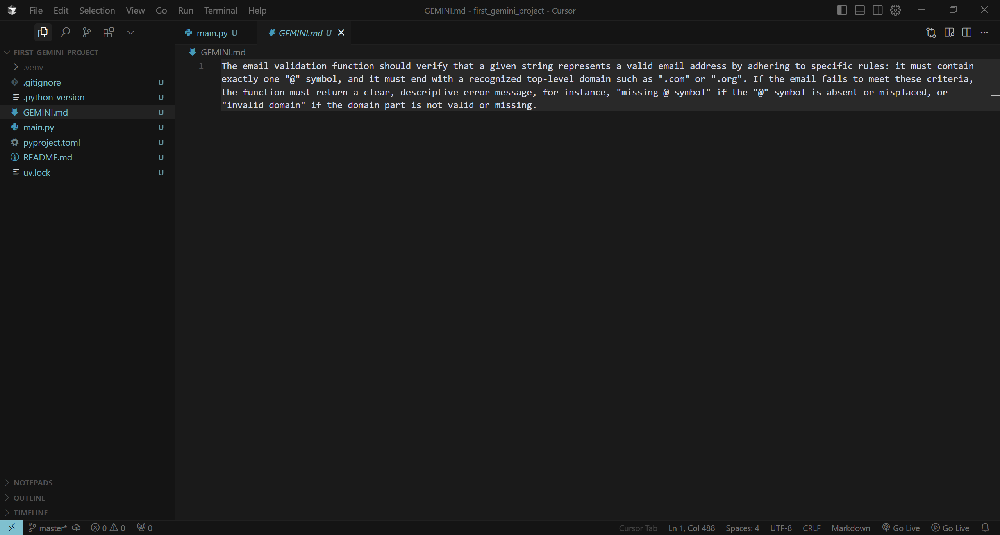

# AIDD 30 Days Challenge – Task 02
**Student:** Sana Asif  
**Class Slot:** Friday 6:00 PM – 9:00 PM  

---

## Part A – Theory

### 1. Nine Pillars Understanding

**Q1. Why using AI Development Agents helps your growth as a system architect?**  
AI agents save time on repetitive setup tasks, allowing the developer to focus on system-level thinking.  
They help us concentrate on structure, design, and how everything connects, instead of small manual tasks.

**Q2. How the Nine Pillars help you become an M-Shaped developer?**  
The Nine Pillars build strength in multiple areas like architecture, automation, agents, data, and governance.  
This helps us develop broad abilities with deep knowledge in key areas, which is the core of becoming an M-shaped developer.

---

### 2. Vibe Coding vs Specification-Driven Development

**Q1. Why vibe coding causes problems after one week?**  
Vibe coding lacks planning.  
After a few days, the code becomes confusing, hard to understand, and filled with bugs because nothing is structured.

**Q2. How Specification-Driven Development prevents those problems?**  
Specification-driven development uses a clear written plan from the beginning.  
This keeps the code clean, organized, and easy to maintain because each part follows a defined structure.

---

### 3. Architecture Thinking

**Q1. How architecture-first thinking changes the developer's role in AIDD?**  
The developer shifts from only writing code to designing the whole system.  
They make decisions about workflows, data flow, and overall system behavior.

**Q2. Why developers must think in layers instead of raw code?**  
Systems have layers like UI, logic, data, and workflows.  
Layered thinking keeps the system scalable, organized, and professional, while raw-code thinking creates mess and complexity.

## Screenshot 1

## Screenshot 2

## Part C — Multiple Choice Questions

1. What is the main purpose of Spec-Driven Development?  
**Answer: B — Clear requirements before coding begins**

2. What is the biggest mindset shift in AI-Driven Development?  
**Answer: B — Thinking in systems and clear instructions**

3. Biggest failure of Vibe Coding?  
**Answer: B — Architecture becomes hard to extend**

4. Main advantage of using AI CLI agents (like Gemini CLI)?  
**Answer: B — Handle repetitive tasks so dev focuses on design & problem-solving**

5. What defines an M-Shaped Developer?  
**Answer: C — Deep skills in multiple related domains**
